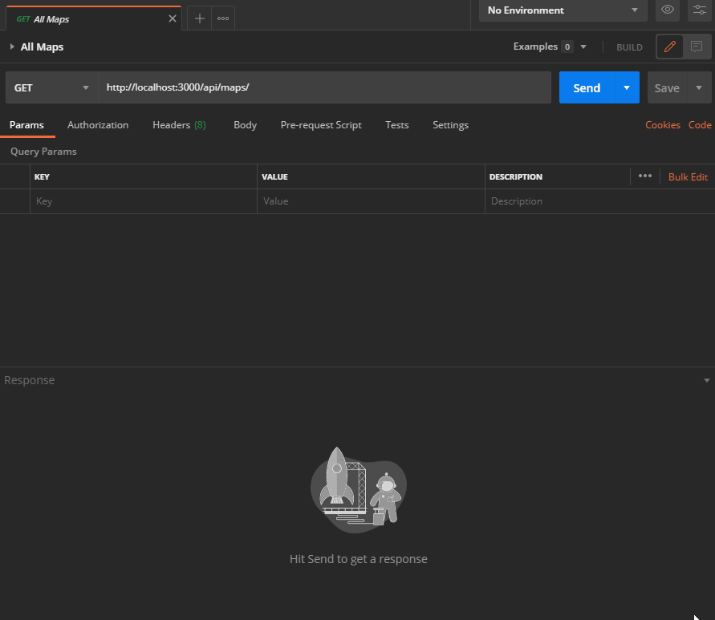
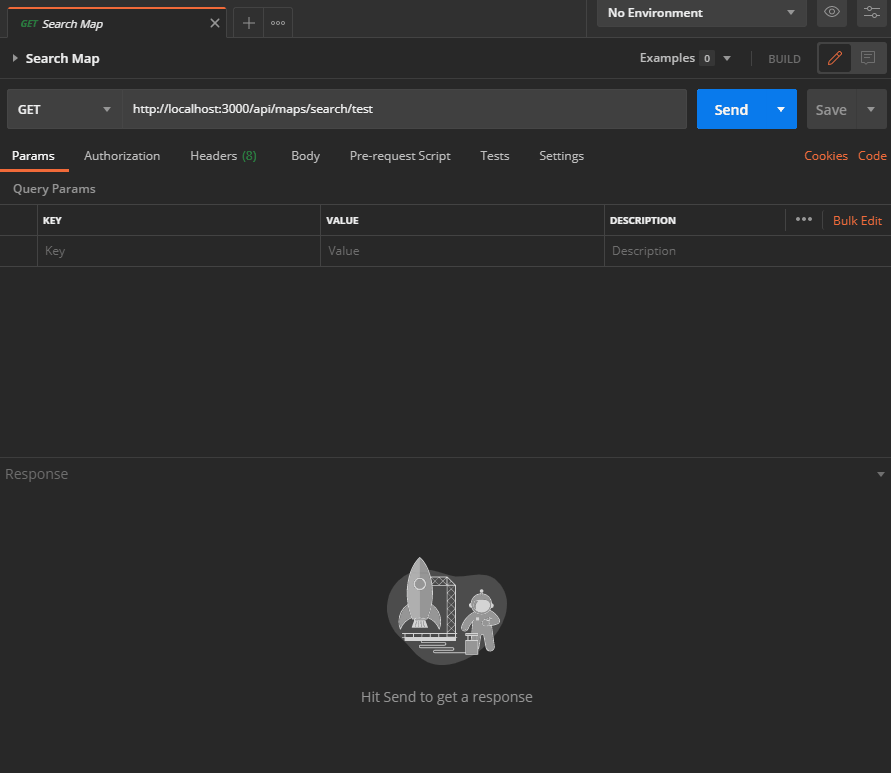

# _Maps_ Endpoints

These endpoints deal with all kinds of _maps_-related stuff (who'd have thought, right?). You'll find all endpoints thoroughly documented in the following sections.

The general prefix for _map_-endpoints is: `/api/maps/`

## Index

- [_Maps_ Endpoints](#maps-endpoints)
  - [Index](#index)
  - [`/`](#)
  - [`/:id([0-9a-fA-F]{24})`](#id0-9a-fa-f24)
  - [`/search/:qry`](#searchqry)

## `/`

* Supported methods: `GET`
* Response Content-Type: `application/json`
* User needs to be **authenticated**

This endpoint can be used to get a list of all available maps of the logged in user and their short descriptions.

A successful response has the following format:

```json
{
    "success": true,
    "code": 200,
    "body": [
    {
        "_id": "5f55fe7ae09c2e2b14fa74c6",
        "name": "Test Map",
        "desc": "A semi-random map to properly test the KainPlan app."
    }
}
```

<p align="center">
  
</p>

## `/:id([0-9a-fA-F]{24})`

* Supported methods: `GET`
* Response Content-Type: `application/json`

This URL is used to retrieve a map. The URL consists of the map's _24 hex-character_ id and the response corresponds to a map model.

This is what a successful response looks like:

```json
{
    "success": true,
    "code": 200,
    "body": {
        "_id": "5f55fe7ae09c2e2b14fa74c6",
        "name": "Test Map",
        "desc": "A semi-random map to properly test the KainPlan app.",
        "width": 1920,
        "height": 1080,
        "background": [ ],
        "nodes": [ ]
    }
}
```

<p align="center">
  
</p>

## `/search/:qry`

* Supported methods: `GET`
* Response Content-Type: `application/json`

Make requests to this endpoint to search for maps according to the URL-parameter `qry`.

A successful response looks something like (in this case, the `qry` was `test`):

```json
{
    "success": true,
    "code": 200,
    "body": [
        {
            "_id": "5f55fe7ae09c2e2b14fa74c6",
            "name": "Test Map",
            "desc": "A semi-random map to properly test the KainPlan app."
        },
        {
            "_id": "5f6714a931f45f2638f65887",
            "name": "New Map",
            "desc": "A new test map ... "
        }
    ]
}
```

<p align="center">
  
</p>
