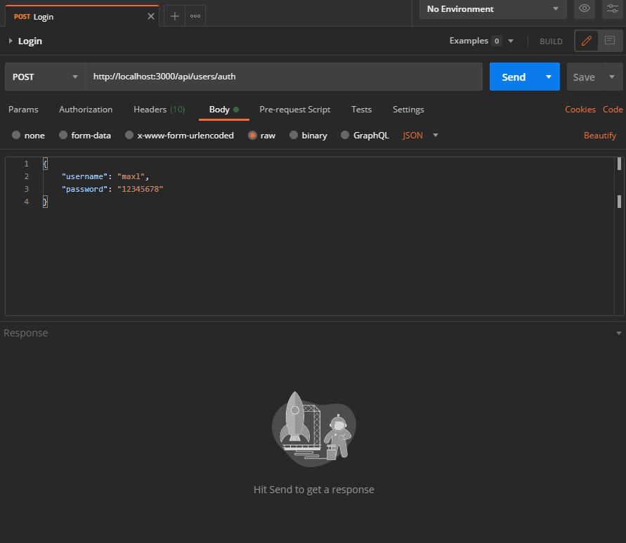
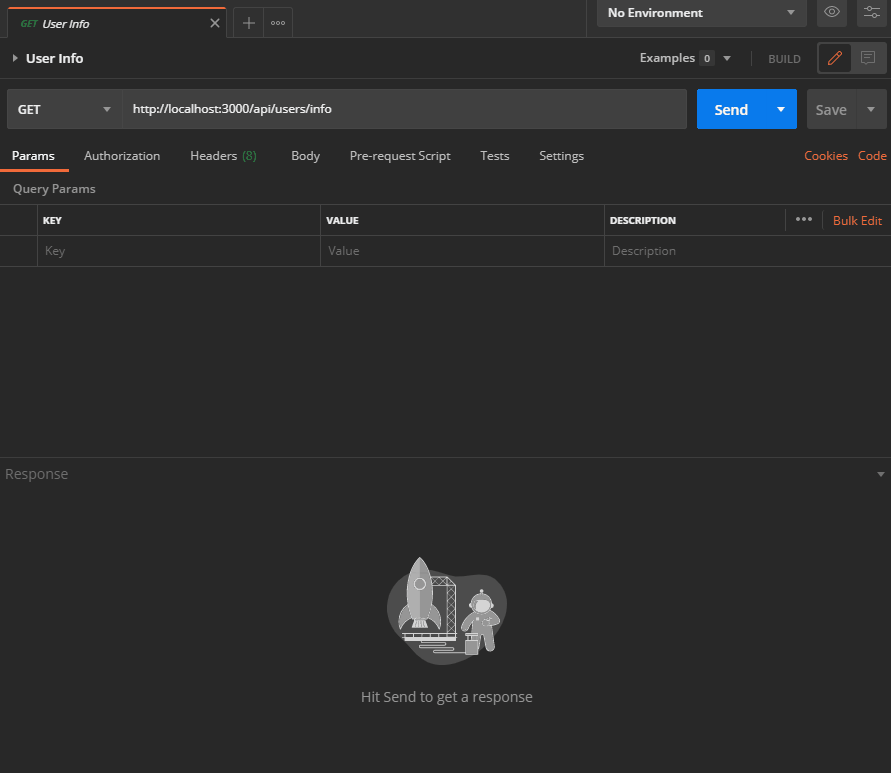
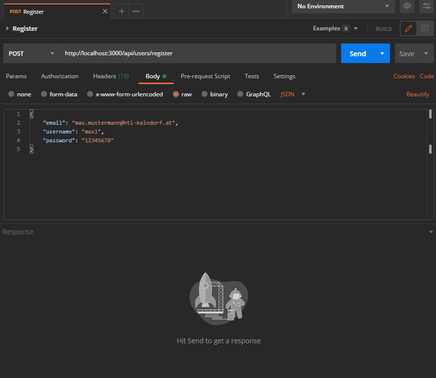
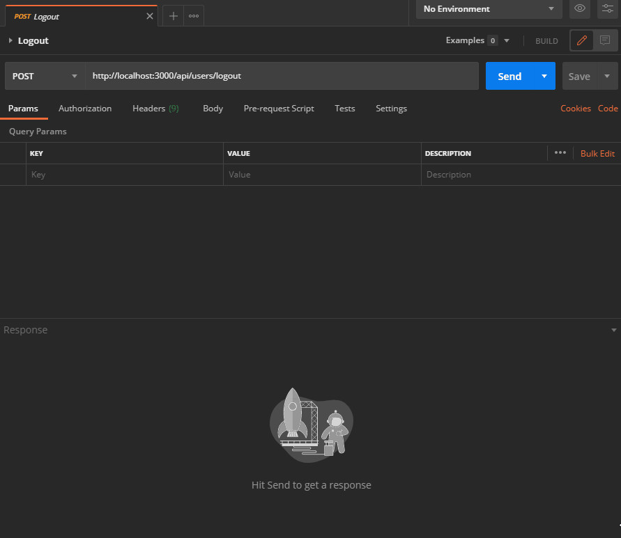

# _Users_ Endpoints

The _users_-endpoints deal with, as the name itself suggests, all kinds of activities related to user accounts. This ranges from _creating_ and _editing_ accounts to _deleting_ them entirely.

The general prefix for _user_-endpoints is: `/api/users/`

## Index

- [_Users_ Endpoints](#users-endpoints)
  - [Index](#index)
  - [`/auth`](#auth)
  - [`/auth/google`](#authgoogle)
  - [`/auth/google/callback`](#authgooglecallback)
  - [`/info`](#info)
  - [`/register`](#register)
  - [`/logout`](#logout)

## `/auth`

* Supported methods: `POST`
* Request Content-Type: `application/json`
* Required parameters:
  * `username` ... the username
  * `password` ... the password
* Response Content-Type: `application/json`

This endpoint is used for authenticating the user with the `passport` module. This is also the URL that should be used for any login request.

On success, this page will display the same user information as a response from [`/info`](#info) would display.

<p align="center">
  
</p>

## `/auth/google`

* Supported methods: `GET`
* **Google OAuth 2.0** Endpoint

This is a special **Google** endpoint. This URL should be redirected to, once the user clicks on the _Sign-In with Google_ button. It will then redirect the user to Google's account selection, where more _magic_ happens ... ^^

## `/auth/google/callback`

* Supported methods: `GET`
* **Google OAuth 2.0** Endpoint

This endpoint **must** only be used by Google. Don't use it in any frontend pages. It's the page that Google returns to, once account selection and Google authentication has completed. It will then redirect the user to their _dashboard_ (`/dashboard`).

## `/info`

* Supported methods: `GET`
* Response Content-Type: `application/json`
* User needs to be **authenticated**

This endpoint is used to get some basic information about the current user account. It can **only** be accessed by signed-in users and will return _sanitized_ info about this user account (stripped of password hashes and other sensitive information).

This is what a successful response looks like:

```json
{
    "success": true,
    "code": 200,
    "body": {
        "user": {
            "id": 5,
            "email": "asdf@asdf.com",
            "username": "asdf"
        }
    }
}
```

... this endpoint can be used for retrieving information about the user after they have already signed in (for example on an about page). However, consider storing / caching the info on the client side as well, just to reduce network traffic and server load.

<p align="center">
  
</p>

## `/register`

* Supported methods: `POST`
* Request Content-Type: `application/json`
* Required parameters:
  * `email` ... the user's email address
  * `username` ... the username
  * `password` ... the password
* Response Content-Type: `application/json`

You can probably guess what this endpoint has been designed to do: yes, it registers new user accounts after checking the validity of the given parameters (list is above).

If a user account is valid, however, it will be created, **but** the user will not be signed in immediately - in the frontend, you'd need to redirect them to the login page still. (In the future, we might implement some sort of email verification mechanism, which is one of the reasons why logging the user in instantly after their account has been created is not the best idea).

A successful response from this endpoint will be of the format:

```json
{
    "success": true,
    "code": 200
}
```

<p align="center">
  
</p>

## `/logout`

* Supported methods: `POST`
* Response Content-Type: `application/json`
* User needs to be **authenticated**

Use this API endpoint to end user sessions. Whenever you make a request to this URL, all identifying tokens (session cookies, etc.) will be stripped from the client - it returns to its state before signing in at all.

This is what a successful response looks like:

```json
{
    "success": true,
    "code": 200
}
```

<p align="center">
  
</p>
